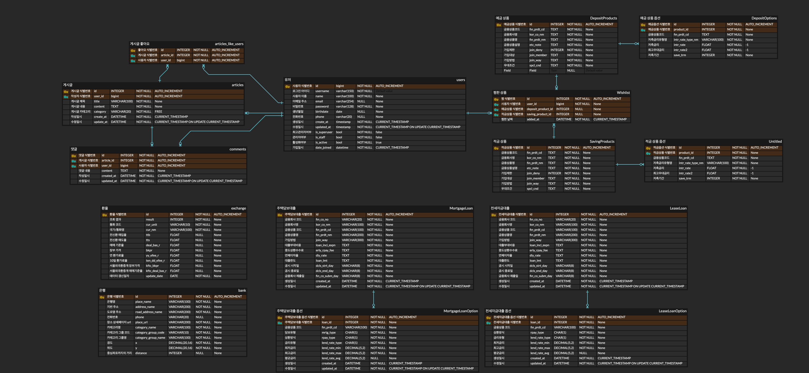

# PuddingBank 🍮
금융이 달콤해지는 순간, 당신의 첫 금융 상품 추천 플랫폼

## 서비스 소개
Pudding Bank는 SSAFY 12기 1학기 관통프로젝트의 일환으로, 처음 금융 상품을 접하는 사용자들을 위한 맞춤형 금융 상품 추천 서비스입니다. 복잡한 금융 상품들을 디저트처럼 달콤하고 친근하게 비교하고 선택할 수 있도록 도와드립니다.

## 주요 기능

- **스마트 금융 상품 비교**
  - 예금/적금 실시간 금리 비교
  - 은행별 전세자금/주택담보대출 상품 조회
  - 맞춤형 필터링 시스템

- **MBTI형 금융 추천 서비스**
  - 대화형 질문을 통한 맞춤형 대출 상품 추천
  - 사용자 성향 분석 기반 금융 상품 매칭
  - 직관적인 결과 시각화

- **실시간 금융 정보**
  - 실시간 환율 정보 및 계산기
  - 주요 통화 환율 추이 그래프(추후 구현)
  - 환전 예약 서비스(추후 구현)

- **스마트 은행 찾기**
  - 현재 위치 기반 주변 은행 검색
  - 은행별 실시간 영업 정보

- **금융 커뮤니티**
  - 금융 상품 리뷰 게시판
  - 카테고리별 게시판
  - 초보자를 위한 금융 용어 설명(추후 구현)

## ERD

## 프로젝트 기간
2024.11.18 - 2024.11.27

## 프로젝트 진행 과정
## 프로젝트 진행 과정

### 2024/11/18
- **초기 환경 구축**
  - Django & Vue.js 프로젝트 생성
  - Django 앱 구성 (accounts, articles, exchanges, locations, products)
  - REST Framework 기반 인증 시스템 구현
  - 금융 상품 정보 관리 기본 구조 구현

- **Frontend 기초 개발**
  - 메인 페이지 UI 구현
  - 게시판 전체 조회 페이지 구현

### 2024/11/19
- **데이터 구조 설계**
  - User Model과 Articles 데이터 구조 동기화
  - Fixtures 데이터 구축 (articles, comments, users)

- **API 시스템 구현**
  - 환율 정보 시스템 구축
    - 주말 데이터 처리 로직
    - 환율 계산 알고리즘 검증
  - 은행 위치 서비스 개발
    - 카카오 로컬 API 연동
    - 위치 기반 검색 기능 구현

### 2024/11/20
- **사용자 시스템 고도화**
  - dj_rest_auth 기반 인증 시스템 재구성
  - Auth View 구조화
  - 회원가입/로그인 중복 검사 추가

- **게시판 기능 확장**
  - 상세 페이지 구현
  - 댓글 시스템 개발
  - 사용자 인증 연동

### 2024/11/21
- **커뮤니티 시스템 개발**
  - 게시글 CRUD 기능 구현
  - 좋아요 시스템 추가
  - 회원 관리 시스템 보완
  - 은행 검색 기능 개선

### 2024/11/22
- **금융 서비스 핵심 기능 구현**
  - 대출 상품 추천 시스템 개발
  - 예적금 비교 서비스 구축
    - 상품 유형별 탭 구성
    - 필터링 시스템 구현
    - 상세 정보 페이지 개발
    - 관심 상품 등록 기능

- **게시판 시스템 완성**
  - 카테고리 시스템 구현
  - 검색 기능 추가
  - 사용자별 게시글 관리

### 2024/11/23
- **대출 상품 서비스 완성**
  - 상품 비교 페이지 개발
  - 사용자 인터페이스 최적화

### 2024/11/24
- **UI/UX 디자인**
  - 브랜드 아이덴티티 구축
    - 로고 및 파비콘 제작
    - MBTI 테스트 디자인
    - 페이지 타이틀 시스템
  - 디자인 시스템 확립
    - 디저트 컨셉 적용
    - 마이페이지 구조 최적화
    - 전체 디자인 가이드라인 수립

## 사용 기술
- Frontend: Vue.js
- Backend: Django, Django REST Framework
- External APIs: 카카오 로컬 API, 환율 API, 금융감독원 API
- 인증: dj_rest_auth

## 팀원 소개
| Profile | Role | GitHub |
|:---:|:---:|:---:|
|  | Backend, Frontend | [@waterhyun](https://github.com/waterhyun) |
|  | Backend, Frontend| [@sjisu7525](https://github.com/sjisu7525) |
